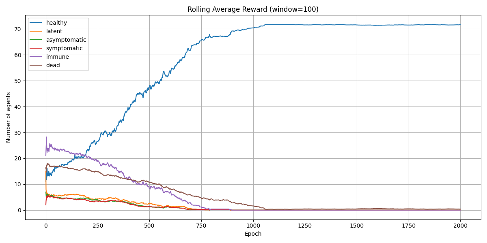
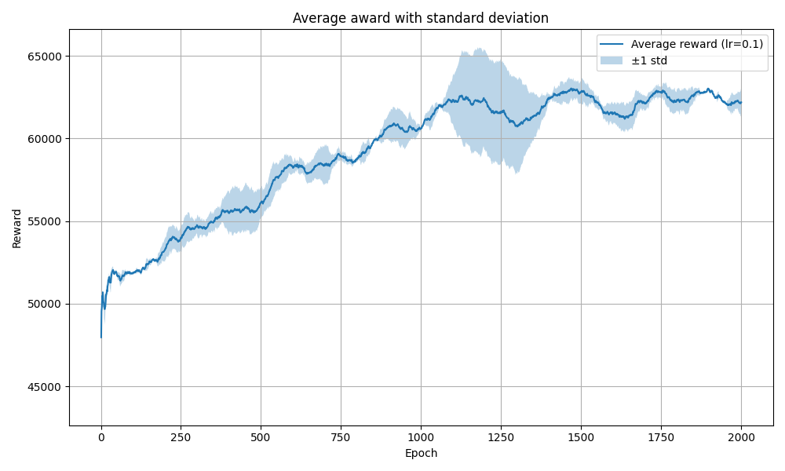

# Disease Spread Simulator with Q-Learning and Agent-Based Modeling

This repository contains the implementation of an **agent-based simulation framework** designed to model the spread of infectious diseases in a population. It uses **Q-learning** to dynamically optimize pandemic control policies such as lockdown severity and mask mandates.

The simulator is capable of simulating realistic virus transmission scenarios and provides a platform for testing the effectiveness of public health interventions.

## Abstract

This project aims to simulate the spread of a contagious disease (like COVID-19) using a grid-based agent-based model. Each agent can become infected, recover, or die, and can travel through public areas and homes. A **Q-learning agent** acts as a decision-maker that dynamically selects public policy actions (like lockdown levels) to maximize a multi-objective reward function that balances:

- Economic output
- Public health
- Psychological well-being

## Key Features

- Realistic agent mobility and contact behavior
- Stochastic infection model based on proximity and behavior
- Reward function balancing economy, health, and stress
- Q-learning algorithm with adjustable parameters

## Simulation Results

### Epidemic Trajectory under Learned Policy

> _Figure 1:_ Number of infected, healthy, and deceased individuals over time using the policy learned by the Q-learning agent. The agent introduces strict measures early (mask usage, staying at home), significantly reducing infections. Later, it gradually relaxes policies without triggering a second wave.

### Reward Evolution during Training

> _Figure 2:_ Average reward per epoch during training. The agent initially explores randomly, but around epoch 50, it starts to discover better policies. By epoch 1000, the policy stabilizes, optimizing the trade-off between public health and societal costs.

## More Information

All design decisions, algorithms, and experimental results are thoroughly described in the attached paper:

** Simulation of the Spread of Diseases in the Population — Wojciech Suski (April 2025)**  
See [`SimulationOfTheSpreadOfDiseases - paper`](SimulationOfTheSpreadOfDiseases%20-%20paper.pdf) for full details.
